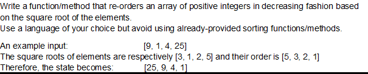

Time Complexity: O(n^2)

Auxiliary Space: O(1)

Boundary Cases: Insertion sort takes maximum time to sort if elements are sorted in reverse order. And it takes minimum time (Order of n) when elements are already sorted.

Note: 
Inserion sorting:

Best: Time Complexity: O(n)

Average: Time Complexity: O(n^2)

Worst :Time Complexity: O(n^2)

Space complexity: O(1)

